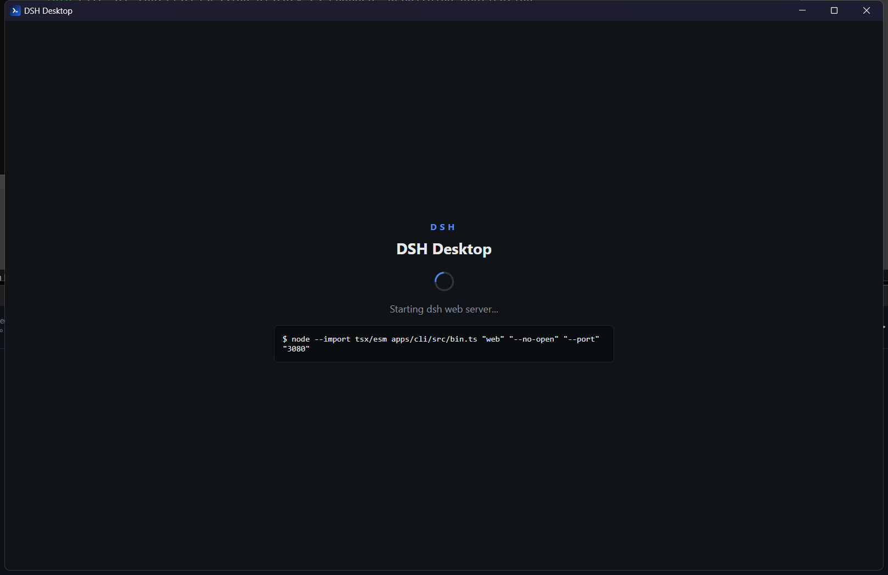
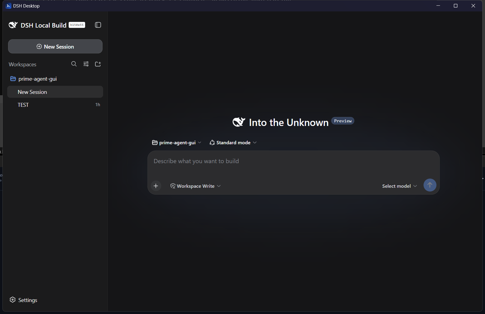

<div align="center">


# DSH Desktop

**A native desktop window for the [DeepSeek Harness](https://github.com/deepseek-ai/deepseek-harness) web UI.**

Cross-platform (Windows / macOS / Linux) launcher built with **Tauri 2** — it starts the
harness server, waits for it, and hands your whole window over to the UI. No browser tab
needed.

[](https://github.com/zerr0o/dsh-desktop/releases)
[](#)
[](https://v2.tauri.app/)

</div>

---

## Screenshots

**Startup — the app boots the harness server and streams its progress:**



**Ready — the full DeepSeek Harness web UI runs inside the native window:**



## How it works

1. On launch, the app probes `http://127.0.0.1:3080`.
2. If a harness server already answers, it is **reused as-is** (never killed).
3. Otherwise the app spawns `pnpm dsh web --no-open --port 3080` from your
   DeepSeekHarness checkout, with the portable Node put on `PATH` automatically.
4. It polls the server (up to 120 s) while showing a status screen with live
   server output, then navigates the window to the web UI.
5. On window close, the spawned server process tree is terminated. A server the
   app did not start is left untouched.

## Prerequisites

- A [DeepSeekHarness](https://github.com/deepseek-ai/deepseek-harness) checkout with
  `pnpm install` and `pnpm run build` completed.
- A Node.js ≥ 24.5 runtime for the server (the default config points at the portable
  Node shipped in the checkout at `.tools/node-win`).
- WebView2 runtime (preinstalled on Windows 10/11).
- To build from source: the [Rust toolchain](https://rustup.rs) (+ MSVC on Windows).

## Install

### Download

Grab `DSH Desktop_0.1.0_x64-setup.exe` from the
[releases page](https://github.com/zerr0o/dsh-desktop/releases) and run it — or just run
`src-tauri/target/release/dsh-desktop.exe` from a source build.

### Build from source

```sh
git clone https://github.com/zerr0o/dsh-desktop.git
cd dsh-desktop
npm install
npm run tauri build     # exe + NSIS installer in src-tauri/target/
```

## Configuration

Every default can be overridden by placing a `config.json` next to the executable:

```json
{
  "workdir": "E:\\Documents\\GitHub\\DeepseekHarness",
  "nodeDir": "E:\\Documents\\GitHub\\DeepseekHarness\\.tools\\node-win",
  "corepackCmd": "corepack.cmd",
  "host": "127.0.0.1",
  "port": 3080,
  "startupTimeoutSecs": 120
}
```

On macOS/Linux, point `workdir`/`nodeDir` at the local checkout and use `corepack`
instead of `corepack.cmd`.

## Development

```sh
npm run tauri dev       # debug build with console output
cargo check             # type-check the Rust side (src-tauri/)
```

The frontend (`src/`) is plain HTML/CSS/JS served directly by Tauri — no bundler.

## Project layout

```
src/           status screen (vanilla HTML/CSS/JS, no build step)
src-tauri/     Rust app: config, server spawn/supervise/teardown, window
docs/          screenshots
```

## Disclaimer

Community project — not affiliated with or endorsed by DeepSeek. "DeepSeek Harness"
is a trademark of DeepSeek; this project only claims compatibility, per the
[brand guidelines](https://github.com/deepseek-ai/deepseek-harness/blob/master/BRAND_GUIDELINES.md).

## License

[MIT](LICENSE)
